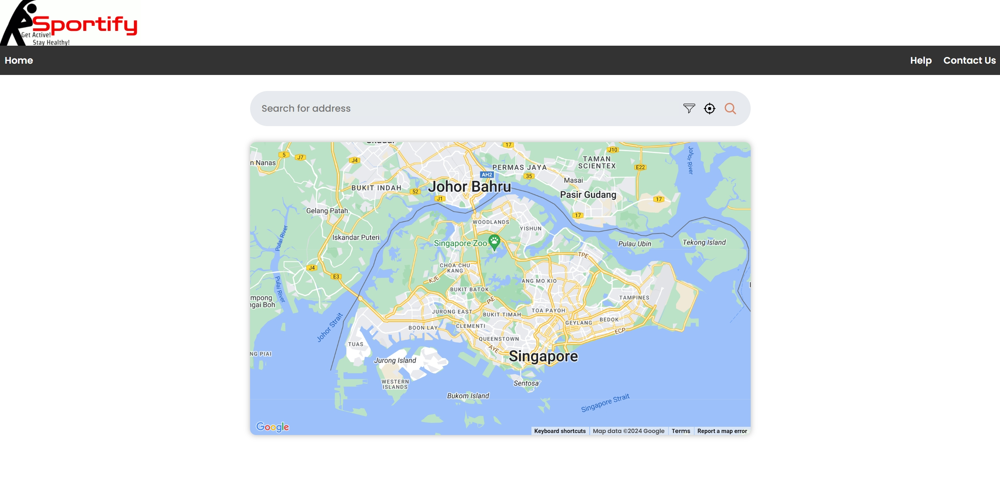

# Sportify

## Screenshot

## Project Description
Sportify aims to help users to find a nearby sports location based on the weather condition and mode of transport. Through our application, users can view information about each location such as the type of activities the location offers and the address. Additionally, with the built in check-in and check-out features, users will get a fairly accurate idea of how crowded the venue is at the current time. With Sportify, sports enthusiasts or those aiming for a healthy lifestyle will have an easier time deciding what type of sports to play or which sports venue to visit. This also reduces the possibility of making wasted trips due to unexpected weather conditions and overcrowding at the sports venue.

## Set Up Instruction

## Web App Demo

[Click here to see the demo!](https://youtu.be/couJMGCY0mY)
